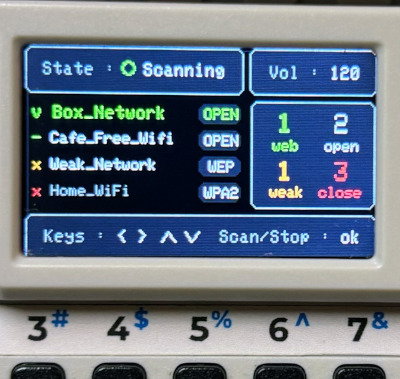

# M5Cardputer OpenWiFi Scanner

This tool continuously scans for open networks, searching for internet access, and generates a report of the surrounding Wi-Fi networks. It displays the detected networks, categorized by their security status.



## Usage

Monitor nearby Wi-Fi networks continuously, providing real-time feedback through both the display, an LED, and a speaker:

### Screen:

- <b>Green</b>: Indicates networks that provide open access to the internet.
- <b>White</b>: Indicates networks that are open without encryption but may not provide internet access.
- <b>Orange</b>: Indicates networks that use outdated or weak encryption, potentially at risk.
- <b>Red</b>: Indicates networks that are securely encrypted and protected.

### LED:

- <b>Green LED</b>: Lights up when open networks or networks with web access are detected.
- <b>Orange LED</b>: Lights up when vulnerable networks are detected.
- <b>Red LED</b>: Lights up when only closed networks are found.

### Speaker:

- <b>One bip tone</b>: Plays when a vulnerable network is detected.
- <b>Two bip Tone</b>: Plays when an open network is found.
- <b>Melody tone</b>: Plays when a web access network is available.

## Installation

- <b>M5Burner</b> : Search into M5CARDPUTER section and simply burn it
- <b>Old school</b> : Get the firmware from the latest github release.

## Keybinds
```
ARROW_RIGHT     Brightness +
ARROW_LEFT      Brightness -

ARROW_UP        Volume +
ARROW_DOWN      Volume -

KEY_OK          Start/Stop scanning   
```

## Disclaimer

This tool is intended solely for educational and security purposes. It is designed to help users understand and assess the security of Wi-Fi networks. Do not use this tool to attempt unauthorized access to private networks. Unauthorized access to networks is illegal and unethical. Always obtain proper permission from the network owner before performing any scans or security assessments.